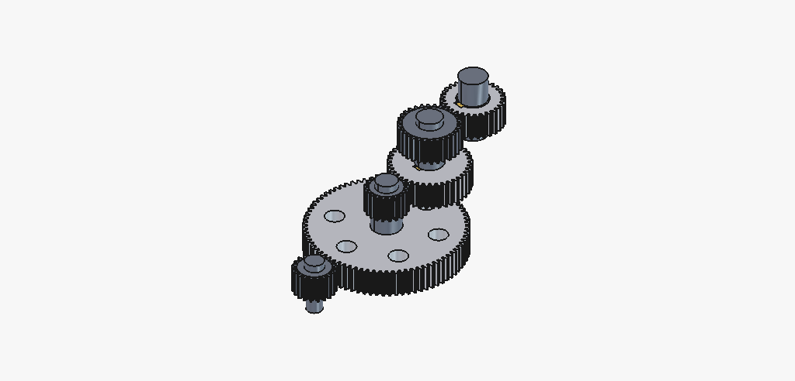
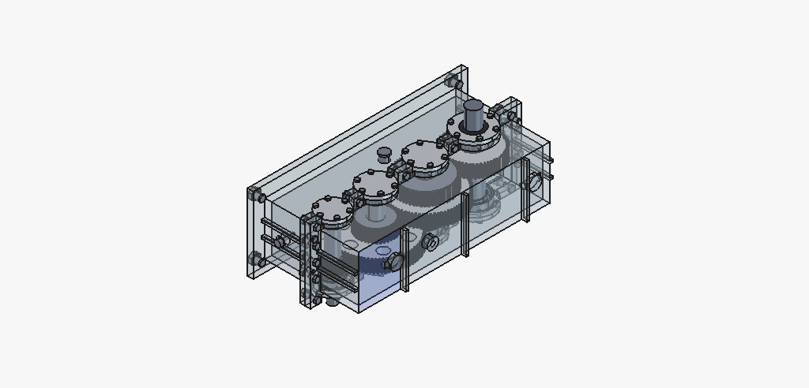

# agentic-freecad-exp

Building real gear reducers in FreeCAD by driving a **FreeCAD instance on another
machine over [MCP](https://modelcontextprotocol.io)** — with the full process and
every pitfall written down.

Three cylindrical gear reducers came out of this experiment, all parameterised and
script-generated, all audited part-by-part for interference:

| design | ratio | shafts | parts | model |
|---|---|---|---|---|
| [single-stage](docs/02-design-single-stage.md) | 3.000 | 2 | 14 | [`models/reducer_single_stage.FCStd`](models) |
| [two-stage, expanded](docs/03-design-two-stage.md) | 12.000 | 3 | 21 | [`models/reducer_two_stage.FCStd`](models) |
| [three-stage, expanded](docs/04-design-three-stage.md) | 8.000 | 4 | 41 | *(script-generated model pending — see below)* |

<p align="center">
  
  
</p>

```bash
git clone https://github.com/Misaka0x272F/agentic-freecad-exp
cd agentic-freecad-exp

freecadcmd -P src -c "import build_two_stage as m; m.main()"   # build
freecadcmd -P src -c "import verify; verify.main('two')"       # audit
```

---

## What is included

Each design is a complete transmission plus its enclosure: involute gears with
genuine tooth profiles and root fillets, stepped shafts with GB/T 1096 keyways,
deep-groove ball bearings with balls, flanged end caps (through and blind), and a
split cast housing with bearing bosses, flanges, ribs and bolt holes.

| | single-stage | two-stage | three-stage |
|---|---|---|---|
| module | m = 4 | m₁ = 3, m₂ = 4 | m = 3 |
| teeth | 20 / 60 | 20 / 80 and 20 / 60 | 20 / 80, 38 / 76, 56 / 56 |
| centre distances | 160 | 150 and 160 | 150, 171, 168 |
| bearings | 6206 ×2, 6209 ×2 | 6206 ×2, 6209 ×2, 6214 ×2 | 6207 / 6208 / 6209 / 6211 |
| material volume | 7.74 L | 16.34 L | ≈ 22.6 L |
| end caps | 2 through + 2 blind | 2 through + 4 blind | 2 through + 6 blind |

The two-stage and three-stage designs are **expanded** (展开式) layouts: the
intermediate shafts carry the wheel of one stage and the pinion of the next, so
the meshes sit at different axial stations. See
[docs/03](docs/03-design-two-stage.md) for why that shapes everything.

### The three-stage model is documented but not committed

Its 41 parts live only on the CAD host. Committing the binary would contradict the
point of this repository, which is that **models are produced by scripts**.
[docs/04-design-three-stage.md](docs/04-design-three-stage.md) records the design,
the process, the verification and — importantly — that it uses a *different
coordinate convention* (shafts along +Z, split at X = 0) from the rest of the
repository, so it cannot be merged without rotating it into the repo frame. That
document is in Chinese; the rest of `docs/` is in English.

## Verification

Every committed model is audited by a **separate** program that re-opens the saved
file and re-derives geometry from scratch — it does not trust the builder.

| check | single-stage | two-stage |
|---|---|---|
| solids valid | 14 / 14 | 21 / 21 |
| centre distance, measured from cylindrical faces | 160.000000 mm | 150.000000 / 160.000000 mm |
| pairs with non-zero intersection volume | **0** of 91 | **0** of 210 |
| gear meshes touching without overlap | ✓ | ✓ both stages |
| keyway cut volume vs closed-form solution | 4 / 4 exact | 6 / 6 exact |
| tooth counts recovered by clustering tip vertices | 20 / 60 ✓ | 20 / 80 / 20 / 60 ✓ |

Three-stage build, as recorded by its session: 41 parts all valid, 820 pairs
pre-filtered to 201 candidates, **all zero**; connectivity analysis returns a
single component (no orphan parts); ratio 4.000 × 2.000 × 1.000 = 8.000.

Full output: [docs/05-verification.md](docs/05-verification.md).

## Repository layout

```
src/
  common.py              reusable geometry + the repository's design conventions
                         (read the docstring at the top first)
  housing.py             parameterised split-cast housing builder
  build_single_stage.py  design 1
  build_two_stage.py     design 2
  verify.py              independent audit; exits non-zero on failure
  render.py              offscreen PNG rendering (needs a GUI — see the caveat)
render.sh                wrapper that runs render.py under Xvfb
models/                  the two verified models, plus original-build/ holding the
                         first generation, whose hub keyways are defective
images/                  process renders of the three-stage build: gear train,
                         housing iterations, bearings and end caps, assembly
docs/
  01-remote-mcp-workflow.md   driving FreeCAD on another machine
  02-design-single-stage.md   design 1, dimensions and reasoning
  03-design-two-stage.md      design 2, the expanded layout
  04-design-three-stage.md    design 3, and the coordinate-convention mismatch (中文)
  05-verification.md          the audit, and what each check actually catches
  06-lessons-learned.md       the pitfalls  ← start here if you build on this
```

## Design conventions

Full text at the top of `src/common.py`:

* millimetres and degrees;
* **shaft axes along +X, all axes in the plane z = 0** — the housing is split
  along that plane into `Housing_Base` (z < 0) and `Housing_Cover` (z > 0);
* gears are built in a local frame (**axis +Z, tooth centre on local +X**) and
  placed by `gear_placement()`;
* flat keys per GB/T 1096, selected by `key_for(shaft_diameter)`.

## The workflow, in one paragraph

An MCP server (`uvx freecad-mcp`) on the agent side bridges to an addon inside
FreeCAD on the CAD side over XML-RPC on port 9875. Nearly all work goes through
one tool — `execute_code`, which runs FreeCAD Python directly — so the loop was:
**probe what the install can actually do → measure the conventions rather than
assume them → build with parameters at module level → verify numerically in the
same breath → only then look at a screenshot.** The full account, including the
network allowlist trap, where headless execution actually runs, and where
rendering should live, is in
[docs/01-remote-mcp-workflow.md](docs/01-remote-mcp-workflow.md).

## Lessons worth reading before you try this

The list is long ([docs/06](docs/06-lessons-learned.md)); these are the ones that
cost real time.

1. **`Part::Feature.Shape` already has the Placement applied.** Assign `.Shape`
   then `.Placement` and FreeCAD bakes the rotation into the shape and resets the
   Placement to identity — so a local-frame feature cut through `obj.Shape` lands
   in the wrong place, silently, while `isValid()` stays `True`. Cut local
   features *before* assigning the solid to an object.
2. **`distToShape == 0` cannot prove non-overlap.** It is 0 for touching solids
   *and* for overlapping ones. Use intersection volume.
3. **Bounding boxes of boolean results are ~0.1 mm off** — enough to make an exact
   160.000 mm centre distance measure as 159.888 mm. Read axes from cylindrical
   faces.
4. **`App.Placement` translates after rotating, about the origin.** To rotate about
   an arbitrary axis, `t = axis − R·axis`. Otherwise the cutter flies across the
   machine and removes 0 mm³.
5. **The tip of an involute tooth is a point**, so "the angle that maximises the
   radius" is not the tooth centre. Measure at the pitch circle instead.
6. **Fuse every boss before cutting the cavity** — the split flange is a solid
   plate, and cutting first refills the interior, which makes the housing collide
   with *every* transmission part at once.
7. **Assert that features exist, and prove your checks can fail.** The defective
   keyways in `models/original-build/` survived a full design cycle because a raw
   `True` next to a hand-written `(expect False)` was read as a pass.

## Requirements

* FreeCAD with Python (`freecadcmd` on `PATH`) — developed against 1.0.0 locally
  and 1.1.0 on the CAD machine
* the built-in `PartDesign.fcgear` module, shipped with FreeCAD; the FCGear addon
  is **not** needed
* `xvfb-run` only for `render.sh` — and a lot of patience: offscreen software
  rendering of these models exceeded ten minutes per frame, which is why
  `images/` was captured from a native GUI instead

## Scope and honesty notes

* This is a **geometry** exercise. Nothing is stress-analysed: modules, tooth
  counts and widths were chosen for sensible proportions, not from a strength
  calculation. Load capacity is not asserted.
* Fasteners are modelled as **holes** in designs 1 and 2; the three-stage build
  modelled them as solids and hit the interference problems recorded in
  [section F](docs/06-lessons-learned.md) as a result.
* Bearings are simplified: rings and balls, no cage, no fillets, catalogue sizes.
* `models/original-build/` holds the first-generation files, which have defective
  hub keyways and spurious rim slots. They are kept as evidence, not as reference
  geometry. The committed models are rebuilt with the fix and fully audited.
* The three-stage design's coordinate convention differs from the repository's;
  that is documented rather than papered over.

## License

MIT — see [LICENSE](LICENSE).
